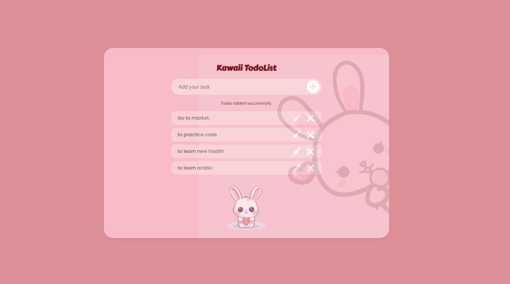

# Kawaii Todo List 

A responsive **Kawaii Todo List** application built with **HTML5**, **CSS3**, and **JavaScript**, inspired by the provided Figma design. The project recreates the cute "kawaii" interface while adding interactive functionality such as creating, editing, deleting, and saving tasks.

The application features a soft pink theme, rounded UI components, a faded bunny watermark, edit and delete controls, and persistent task storage using **Local Storage**, allowing tasks to remain available even after refreshing the page.

---

## 🔗 Live Demo

**Live Site:** https://hayatabdulfetah.github.io/kawaii-todo-list/

---

## 📸 Screenshot

<p align="center">
  
</p>

---

## 🛠️ Built With

- HTML5
- CSS3
- JavaScript (ES6)
- Flexbox
- CSS Media Queries
- Local Storage API
- Google Fonts (Fredoka & Poppins)

---

## ✨ Features

- ➕ Add new tasks
- ✏️ Edit existing tasks
- 🗑️ Delete tasks
- ⌨️ Add tasks using the **Enter** key
- 💾 Automatically save tasks using Local Storage
- 🔄 Restore tasks after refreshing the page
- 🚫 Prevent duplicate tasks (case-insensitive)
- 💬 Dynamic status messages
- 📱 Responsive design for mobile and desktop
- 🐰 Cute kawaii-inspired interface with bunny illustrations

---

## 📂 Project Structure

```text
kawaii-todo-list/
│
├── index.html
├── style.css
├── script.js
├── README.md
│
└── assets/
    ├── add.png
    ├── edit.png
    ├── delete.png
    ├── bunny.png
    ├── background-bunny.jpg
    └── screenshot.png
```

---

## 🚀 My Approach

I started by recreating the Figma design using semantic HTML and CSS, focusing on matching the layout, spacing, colors, typography, and rounded components as closely as possible. After completing the UI, I enhanced the project with JavaScript to make it fully interactive by implementing task creation, editing, deletion, validation, and persistent storage using Local Storage.

Throughout the project, I organized the JavaScript into reusable functions, separated the UI from the application logic, and focused on writing clean, maintainable code.

---

## 💪 Challenges

The biggest challenge was accurately recreating the Figma design while keeping the layout responsive across different screen sizes. Another challenge was implementing the edit functionality without losing task data and ensuring that the displayed tasks, the JavaScript array, and Local Storage always remained synchronized.

---

## 🎯 What Was Easy

Building the HTML structure and styling the interface with Flexbox was straightforward. Once the layout was complete, adding new features step by step made the JavaScript implementation easier to understand and maintain.

---

## 📚 What I Learned

This project helped me strengthen my understanding of:

- Semantic HTML
- CSS Flexbox and responsive design
- DOM manipulation
- Event handling
- Creating and reusing JavaScript functions
- Working with arrays and objects
- Browser Local Storage
- Keeping application data synchronized with the user interface
- Organizing JavaScript into clean, reusable components

---

## 👩‍💻 Author

**Hayat Abdulfetah**
