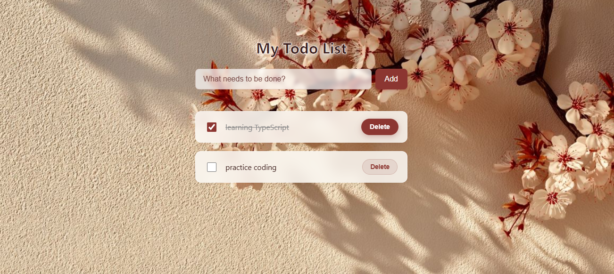

# 🌸 TypeScript Todo Application

A beautifully designed, strictly typed Todo application built with Vanilla TypeScript. This project demonstrates clean architecture, DOM manipulation, and state persistence without relying on heavy frontend frameworks.

## 📸 Preview

<p align="center">
  
</p>

## ✨ Features

- **Strict Type Safety:** Built completely in TypeScript with custom interfaces and strict DOM element typing to prevent runtime errors.
- **MVC Architecture:** Separation of concerns between the data model, application state, and UI rendering logic.
- **Persistent Storage:** Seamlessly saves and retrieves tasks using the browser's `LocalStorage` API.
- **Modern UI/UX:** Features a custom cherry blossom theme with "glassmorphism" (frosted glass) effects, CSS animations, and floating task cards.
- **Zero Dependencies:** Pure HTML, CSS, and TypeScript.

## 📂 Project Structure

```text
TODO_APP/
├── assets/
│   ├── image.png         # Background image for the application
│   └── screenshot.png    # Preview of the completed UI
├── app.ts                # Main application logic (Model, Controller, UI updates)
├── app.js                # Compiled JavaScript output
├── index.html            # Core markup and application container
├── style.css             # Glassmorphism styling, layout, and animations
├── tsconfig.json         # TypeScript compiler configuration
└── README.md             # Project documentation

```

🛠️ Technologies Used
TypeScript (Strict Mode)

HTML5

CSS3 (Flexbox, CSS Variables, Keyframe Animations, Backdrop-filter)

🚀 Getting Started
To run this project locally, follow these steps:

Clone the repository (or download the files to your local machine).

Install TypeScript (if you haven't already):

Bash
npm install -g typescript
Compile the TypeScript file:
Since a tsconfig.json is included, simply run the following command in the project root:

Bash
tsc
(To actively watch for changes while developing, use tsc -w)

Run the App:
Open index.html in any modern web browser. No local server is required, though using one like VS Code's "Live Server" extension is recommended for development.

🧠 Architecture Notes
This project is structured using foundational Model-View-Controller (MVC) principles, making it highly scalable and predictable:

Model: The Todo interface acts as the strict data contract.

State: The todos array and LocalStorage functions act as the single source of truth.

View/Controller: The renderTodos function acts as a pipeline that reads the current state and paints the DOM, completely decoupled from the event listeners that trigger state changes.
